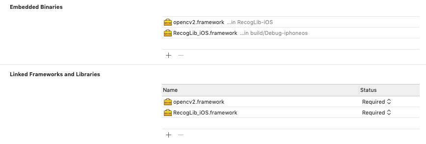

# RecogLib
Recoglib is a library that lets you recognize and categorize a stream of pictures for specific document types. This library is built around the popular opensource framework `OpenCV`

## Document types
Recoglib is capable of recognizing types that include:
- Identity card
- Driving license
- Passport

## Configuration management
For compilation, running and deployment of the application following tools are required. Newer versions of the tools should work, these were tested to work and used during the development:

- Hardware:
    - iOS device with camera for testing
    - macOS device for development
- Software (required for development and deployment):
    - macOS 10.14
    - Xcode 10.2
    - Swift 5.0
    - iOS 11.0

## Installation
### Link your project against RecogLib and OpenCV frameworks 
Go to your project and click on the `Project detail -> General` and under `Embeded binaries` add `RecogLib_iOS.framework` (which should be shown under RecogLib-iOS project) and `opencv2.framework` (which is located at `/[Path to this project]/RecogLib-iOS/opencv2.framework`). Both framework have to be in the `Embedded Binaries` and `Linked Frameworks and Libreries` section and your Xcode project settings should look like this.



## Usage
### 1) Configure `AVCaptureSession`
Recoglib is built to be used with AVCaptureSession. Here is a typical example of implementing `AVCaptureSession`. First initialize `AVCaptureSession` object and start batch configuration by calling `beginConfiguration` method.
```
let session = AVCaptureSession()
session.beginConfiguration()
```
Set up the input device that you'd want to receive video stream from. Please note that you'd want mark `mediaType` as `.video` since Recoglib can't deal with any other types of media. Using the mediaType of `.video` **is mandatory**.
```
let input = AVCaptureDevice.DiscoverySession(deviceTypes: [.builtInWideAngleCamera], mediaType: .video, position: .back)
guard let device = input.devices.first, let deviceInput = try? AVCaptureDeviceInput(device: device) else {
    session.commitConfiguration()
    return
}
session.addInput(deviceInput)
```
Next you need to specify a `AVCaptureVideoDataOutputSampleBufferDelegate` which will receive the video stream from the input specified above. To do that, you need to instanciate `AVCaptureVideoDataOutput` and its settings as shown below.

Please note that the whole video stream will be capture **on a background thread** that needs to be specified explicitly.
```
let output = AVCaptureVideoDataOutput()
output.videoSettings = [kCVPixelBufferPixelFormatTypeKey : kCVPixelFormatType_32BGRA] as [String : Any]
let captureQueue = DispatchQueue(label: "Camera_capture_queue")
output.setSampleBufferDelegate(self, queue: captureQueue)
session.addOutput(output)
```
Lastly you need to commit this configuration and start the capturing.
```
session.commitConfiguration()
session.startRunning()
```

### 2) Configure `DocumentVerifier`
Recoglib comes with `DocumentVerifier` that makes it really easy to use recoglib in your project.
First you initialize `DocumentVerifier` with expected role, country and page.

Note that properties `role`, `country` and `page` are public and can be changed whenever you like.
```
let verifier = DocumentVerifier(role: .Idc, country: .Cz, page: .Front)
```
Than you define the `func captureOutput(_: ,didOutput: ,from:)` delegate method declared in `AVCaptureVideoDataOutputSampleBufferDelegate`
```
extension ViewController: AVCaptureVideoDataOutputSampleBufferDelegate {
    func captureOutput(_ output: AVCaptureOutput, didOutput sampleBuffer: CMSampleBuffer, from connection: AVCaptureConnection) {
        // Recoglib magic happens here
    }
}
```
Lastly call the `verify(buffer: )` method of `DocumentVerifier`. Please note this delegate method **is called from background thread**. If you desire to update your view from this method, you **need** to do so from the main thread as shown below.
```
extension ViewController: AVCaptureVideoDataOutputSampleBufferDelegate {
    func captureOutput(_ output: AVCaptureOutput, didOutput sampleBuffer: CMSampleBuffer, from connection: AVCaptureConnection) {
        let result = verifier.verify(buffer: sampleBuffer)
        DispatchQueue.main.async {
            self.updateView(with: result)
        }
    }
}
```
Alternatively if you have specific frame of the picture that you wish to be verified instead, you can use the `verify(buffer: , displayWidth:, displayHeight: , frameHeight: )` as shown below.
```
extension ViewController: AVCaptureVideoDataOutputSampleBufferDelegate {
    func captureOutput(_ output: AVCaptureOutput, didOutput sampleBuffer: CMSampleBuffer, from connection: AVCaptureConnection) {
        // due to incorrect camera orientation the width has to be switched with height
        let result = verifier.verify(buffer: sampleBuffer, displayWidth: frames.cameraHeight, displayHeight: frames.cameraWidth, frameHeight: frames.frameWidth)
        DispatchQueue.main.async {
            self.updateView(with: result)
        }
    }
}
```
### 3) Result
The returning value of the `verify()` methods is a struct of type `MatcherResult`. It contains all the information found describing currently analysed document.

It contains following values:
- `state` - state of currently analysed image (e.g. `NoMatchFound`, `Blurry` or `ReflectionPresent` etc.)
- `code` - version of a document (e.g. new or old version of slovakia identity card). This attribute can be `nil` when state is equal to `NoMatchFound`
- `role` - specified type of a document
- `country` - specified origin country of a document
- `page` - specified page

